# INTRAK Internship Management System - Architecture Documentation

## Table of Contents

1. [System Overview](#system-overview)
2. [System Architecture Diagram](#system-architecture-diagram)
3. [Process Flow Diagram](#process-flow-diagram)
4. [User Roles & Permissions](#user-roles--permissions)
5. [Core Features](#core-features)
6. [Technical Stack](#technical-stack)
7. [Database Schema](#database-schema)
8. [API Endpoints](#api-endpoints)
9. [Security Features](#security-features)
10. [Deployment Architecture](#deployment-architecture)

---

## System Overview

INTRAK is a comprehensive internship management system designed to streamline and automate the entire internship lifecycle from student placement to completion. The system serves multiple stakeholders including students, academic coordinators, instructors, industry partners, and system administrators.

### Key Objectives

- **Centralized Management**: Single platform for all internship-related activities
- **Process Automation**: Streamlined workflows for document management, attendance tracking, and evaluations
- **Real-time Monitoring**: Live tracking of student progress and system activities
- **Compliance Management**: Automated tracking of requirements and deadlines
- **Reporting & Analytics**: Comprehensive reporting across all stakeholders

---

## System Architecture Diagram

```mermaid
graph TB
    %% External Users
    subgraph "User Roles"
        ADMIN[👨‍💼 Admin]
        COORD[👩‍💼 Coordinator]
        INSTR[👨‍🏫 Instructor]
        STUDENT[👨‍🎓 Student]
        PARTNER[🏢 Industry Partner]
    end

    %% Frontend Layer
    subgraph "Frontend (React + TypeScript)"
        subgraph "Authentication"
            LOGIN[🔐 Login Page]
            AUTH[🔑 Auth Service]
        end

        subgraph "Admin UI"
            ADMIN_DASH[📊 Admin Dashboard]
            USER_MGMT[👥 User Management]
            COMPANY_MGMT[🏢 Company Management]
            SETTINGS[⚙️ System Settings]
        end

        subgraph "Coordinator UI"
            COORD_DASH[📈 Coordinator Dashboard]
            STUDENT_MGMT[👨‍🎓 Student Management]
            DOC_MGMT[📄 Document Management]
            REPORT_MGMT[📋 Report Management]
            ANNOUNCE[📢 Announcements]
        end

        subgraph "Instructor UI"
            INSTR_DASH[📚 Instructor Dashboard]
            ATTEND_VERIFY[✅ Attendance Verification]
            EVAL_MGMT[⭐ Evaluation Management]
            TEMPLATE_MGMT[📝 Template Management]
        end

        subgraph "Student UI"
            STUDENT_DASH[🎯 Student Dashboard]
            DOC_UPLOAD[📤 Document Upload]
            ATTEND_LOG[⏰ Attendance Logging]
            COMPANY_SEL[🏢 Company Selection]
            REPORTS[📊 Student Reports]
        end

        subgraph "Partner UI"
            PARTNER_DASH[🏢 Partner Dashboard]
            PARTNER_ATTEND[⏰ Attendance Monitoring]
            PARTNER_EVAL[⭐ Student Evaluation]
        end
    end

    %% API Layer
    subgraph "Backend API (Node.js + Express)"
        subgraph "Authentication & Authorization"
            JWT[🔐 JWT Authentication]
            ROLE_AUTH[🛡️ Role-based Authorization]
            RATE_LIMIT[🚦 Rate Limiting]
        end

        subgraph "Core Services"
            AUTH_SVC[🔑 Auth Service]
            USER_SVC[👤 User Service]
            STUDENT_SVC[🎓 Student Service]
            COMPANY_SVC[🏢 Company Service]
            DOC_SVC[📄 Document Service]
            ATTEND_SVC[⏰ Attendance Service]
            EVAL_SVC[⭐ Evaluation Service]
            REPORT_SVC[📊 Report Service]
            EMAIL_SVC[📧 Email Service]
            AUDIT_SVC[📝 Audit Service]
        end

        subgraph "Middleware"
            CORS[🌐 CORS]
            HELMET[🛡️ Security Headers]
            COMPRESS[🗜️ Compression]
            MORGAN[📝 Logging]
        end
    end

    %% Database Layer
    subgraph "Database (PostgreSQL + Prisma ORM)"
        subgraph "Core Entities"
            USER_TBL[👤 Users Table]
            STUDENT_TBL[🎓 Students Table]
            COMPANY_TBL[🏢 Companies Table]
            DOC_TBL[📄 Documents Table]
            ATTEND_TBL[⏰ Attendance Logs]
            EVAL_TBL[⭐ Evaluations Table]
            ANNOUNCE_TBL[📢 Announcements]
            AUDIT_TBL[📝 Audit Logs]
        end

        subgraph "Supporting Tables"
            REFRESH_TBL[🔄 Refresh Tokens]
            QR_TBL[📱 QR Tokens]
            TEMPLATE_TBL[📝 Document Templates]
            SETTINGS_TBL[⚙️ Admin Settings]
        end
    end

    %% File Storage
    subgraph "File Storage"
        DOC_STORAGE[📁 Document Storage]
        PROFILE_STORAGE[🖼️ Profile Photos]
        TEMPLATE_STORAGE[📝 Template Storage]
    end

    %% External Services
    subgraph "External Services"
        EMAIL_SERVICE[📧 Email Service]
        QR_GEN[📱 QR Code Generator]
        PDF_GEN[📄 PDF Generator]
        EXCEL_GEN[📊 Excel Generator]
    end

    %% User Connections
    ADMIN --> LOGIN
    COORD --> LOGIN
    INSTR --> LOGIN
    STUDENT --> LOGIN
    PARTNER --> LOGIN

    %% Frontend to Backend
    LOGIN --> AUTH_SVC
    AUTH --> JWT
    AUTH --> ROLE_AUTH

    %% Admin UI Connections
    ADMIN_DASH --> USER_SVC
    USER_MGMT --> USER_SVC
    COMPANY_MGMT --> COMPANY_SVC
    SETTINGS --> USER_SVC

    %% Coordinator UI Connections
    COORD_DASH --> STUDENT_SVC
    STUDENT_MGMT --> STUDENT_SVC
    DOC_MGMT --> DOC_SVC
    REPORT_MGMT --> REPORT_SVC
    ANNOUNCE --> USER_SVC

    %% Instructor UI Connections
    INSTR_DASH --> STUDENT_SVC
    ATTEND_VERIFY --> ATTEND_SVC
    EVAL_MGMT --> EVAL_SVC
    TEMPLATE_MGMT --> DOC_SVC

    %% Student UI Connections
    STUDENT_DASH --> STUDENT_SVC
    DOC_UPLOAD --> DOC_SVC
    ATTEND_LOG --> ATTEND_SVC
    COMPANY_SEL --> COMPANY_SVC
    REPORTS --> REPORT_SVC

    %% Partner UI Connections
    PARTNER_DASH --> STUDENT_SVC
    PARTNER_ATTEND --> ATTEND_SVC
    PARTNER_EVAL --> EVAL_SVC

    %% Service to Database
    USER_SVC --> USER_TBL
    STUDENT_SVC --> STUDENT_TBL
    COMPANY_SVC --> COMPANY_TBL
    DOC_SVC --> DOC_TBL
    ATTEND_SVC --> ATTEND_TBL
    EVAL_SVC --> EVAL_TBL
    REPORT_SVC --> STUDENT_TBL
    REPORT_SVC --> ATTEND_TBL
    REPORT_SVC --> EVAL_TBL
    AUDIT_SVC --> AUDIT_TBL

    %% File Storage Connections
    DOC_SVC --> DOC_STORAGE
    USER_SVC --> PROFILE_STORAGE
    DOC_SVC --> TEMPLATE_STORAGE

    %% External Service Connections
    EMAIL_SVC --> EMAIL_SERVICE
    ATTEND_SVC --> QR_GEN
    REPORT_SVC --> PDF_GEN
    REPORT_SVC --> EXCEL_GEN

    %% Database Relations
    USER_TBL -.-> STUDENT_TBL
    STUDENT_TBL -.-> COMPANY_TBL
    STUDENT_TBL -.-> DOC_TBL
    STUDENT_TBL -.-> ATTEND_TBL
    STUDENT_TBL -.-> EVAL_TBL
    USER_TBL -.-> AUDIT_TBL

    %% Styling
    classDef userRole fill:#e1f5fe,stroke:#01579b,stroke-width:2px
    classDef frontend fill:#f3e5f5,stroke:#4a148c,stroke-width:2px
    classDef backend fill:#e8f5e8,stroke:#1b5e20,stroke-width:2px
    classDef database fill:#fff3e0,stroke:#e65100,stroke-width:2px
    classDef storage fill:#fce4ec,stroke:#880e4f,stroke-width:2px
    classDef external fill:#f1f8e9,stroke:#33691e,stroke-width:2px

    class ADMIN,COORD,INSTR,STUDENT,PARTNER userRole
    class LOGIN,AUTH,ADMIN_DASH,USER_MGMT,COMPANY_MGMT,SETTINGS,COORD_DASH,STUDENT_MGMT,DOC_MGMT,REPORT_MGMT,ANNOUNCE,INSTR_DASH,ATTEND_VERIFY,EVAL_MGMT,TEMPLATE_MGMT,STUDENT_DASH,DOC_UPLOAD,ATTEND_LOG,COMPANY_SEL,REPORTS,PARTNER_DASH,PARTNER_ATTEND,PARTNER_EVAL frontend
    class JWT,ROLE_AUTH,RATE_LIMIT,AUTH_SVC,USER_SVC,STUDENT_SVC,COMPANY_SVC,DOC_SVC,ATTEND_SVC,EVAL_SVC,REPORT_SVC,EMAIL_SVC,AUDIT_SVC,CORS,HELMET,COMPRESS,MORGAN backend
    class USER_TBL,STUDENT_TBL,COMPANY_TBL,DOC_TBL,ATTEND_TBL,EVAL_TBL,ANNOUNCE_TBL,AUDIT_TBL,REFRESH_TBL,QR_TBL,TEMPLATE_TBL,SETTINGS_TBL database
    class DOC_STORAGE,PROFILE_STORAGE,TEMPLATE_STORAGE storage
    class EMAIL_SERVICE,QR_GEN,PDF_GEN,EXCEL_GEN external
```

---

## Process Flow Diagram

```mermaid
flowchart TD
    START([System Initialization]) --> AUTH{Authentication Required}

    %% Authentication Process
    AUTH -->|Valid Credentials| ROLE_DETERMINATION{User Role Determination}
    AUTH -->|Invalid Credentials| AUTH_FAILURE[Authentication Failure]
    AUTH_FAILURE --> AUTH_RETRY[Retry Authentication]
    AUTH_RETRY --> AUTH

    %% Role-Based Access Control
    ROLE_DETERMINATION -->|System Administrator| ADMIN_PORTAL[Administrative Portal]
    ROLE_DETERMINATION -->|Program Coordinator| COORDINATOR_PORTAL[Coordinator Portal]
    ROLE_DETERMINATION -->|Academic Instructor| INSTRUCTOR_PORTAL[Instructor Portal]
    ROLE_DETERMINATION -->|Student Intern| STUDENT_PORTAL[Student Portal]
    ROLE_DETERMINATION -->|Industry Partner| PARTNER_PORTAL[Industry Partner Portal]

    %% Administrative Functions
    ADMIN_PORTAL --> ADMIN_OPERATIONS{Administrative Operations}
    ADMIN_OPERATIONS -->|User Account Management| USER_ADMIN[User Account Administration]
    ADMIN_OPERATIONS -->|System Configuration| SYSTEM_CONFIG[System Configuration Management]
    ADMIN_OPERATIONS -->|Company Registry| COMPANY_REGISTRY[Company Registry Management]
    ADMIN_OPERATIONS -->|System Analytics| SYSTEM_ANALYTICS[System Analytics & Reporting]

    %% Coordinator Functions
    COORDINATOR_PORTAL --> COORD_OPERATIONS{Coordinator Operations}
    COORD_OPERATIONS -->|Student Lifecycle Management| STUDENT_LIFECYCLE[Student Lifecycle Management]
    COORD_OPERATIONS -->|Company Partnership Management| PARTNERSHIP_MGMT[Company Partnership Management]
    COORD_OPERATIONS -->|Document Workflow Management| DOCUMENT_WORKFLOW[Document Workflow Management]
    COORD_OPERATIONS -->|Memorandum of Agreement| MOA_MANAGEMENT[MOA Management System]
    COORD_OPERATIONS -->|Communication Management| COMMUNICATION_MGMT[Communication Management]
    COORD_OPERATIONS -->|Reporting & Analytics| COORD_ANALYTICS[Reporting & Analytics]

    %% Instructor Functions
    INSTRUCTOR_PORTAL --> INSTRUCTOR_OPERATIONS{Instructor Operations}
    INSTRUCTOR_OPERATIONS -->|Student Assignment Management| STUDENT_ASSIGNMENT[Student Assignment Management]
    INSTRUCTOR_OPERATIONS -->|Attendance Verification| ATTENDANCE_VERIFICATION[Attendance Verification System]
    INSTRUCTOR_OPERATIONS -->|Performance Evaluation| PERFORMANCE_EVAL[Performance Evaluation System]
    INSTRUCTOR_OPERATIONS -->|Template Management| TEMPLATE_ADMIN[Document Template Administration]
    INSTRUCTOR_OPERATIONS -->|Student Progress Tracking| PROGRESS_TRACKING[Student Progress Tracking]

    %% Student Functions
    STUDENT_PORTAL --> STUDENT_OPERATIONS{Student Operations}
    STUDENT_OPERATIONS -->|Company Selection Process| COMPANY_SELECTION[Company Selection Process]
    STUDENT_OPERATIONS -->|Document Submission| DOCUMENT_SUBMISSION[Document Submission System]
    STUDENT_OPERATIONS -->|Attendance Logging| ATTENDANCE_LOGGING[Attendance Logging System]
    STUDENT_OPERATIONS -->|Performance Review| PERFORMANCE_REVIEW[Performance Review Access]
    STUDENT_OPERATIONS -->|Report Generation| STUDENT_REPORTING[Report Generation System]

    %% Industry Partner Functions
    PARTNER_PORTAL --> PARTNER_OPERATIONS{Industry Partner Operations}
    PARTNER_OPERATIONS -->|Student Monitoring| STUDENT_MONITORING[Student Monitoring Dashboard]
    PARTNER_OPERATIONS -->|Attendance Oversight| ATTENDANCE_OVERSIGHT[Attendance Oversight System]
    PARTNER_OPERATIONS -->|Student Assessment| STUDENT_ASSESSMENT[Student Assessment System]
    PARTNER_OPERATIONS -->|Document Review| DOCUMENT_REVIEW[Document Review System]

    %% Document Management Workflow
    DOCUMENT_SUBMISSION --> DOCUMENT_VALIDATION{Document Validation}
    DOCUMENT_VALIDATION -->|Validation Successful| DOCUMENT_QUEUE[Document Review Queue]
    DOCUMENT_VALIDATION -->|Validation Failed| DOCUMENT_REJECTION[Document Rejection]
    DOCUMENT_REJECTION --> DOCUMENT_RESUBMISSION[Document Resubmission Required]
    DOCUMENT_RESUBMISSION --> DOCUMENT_SUBMISSION

    DOCUMENT_QUEUE --> COORDINATOR_REVIEW{Coordinator Review Process}
    COORDINATOR_REVIEW -->|Approved| DOCUMENT_APPROVAL[Document Approval]
    COORDINATOR_REVIEW -->|Rejected| DOCUMENT_DENIAL[Document Denial]
    COORDINATOR_REVIEW -->|Revision Required| DOCUMENT_REVISION[Document Revision Request]

    DOCUMENT_APPROVAL --> STAKEHOLDER_NOTIFICATION[Stakeholder Notification]
    DOCUMENT_DENIAL --> STAKEHOLDER_NOTIFICATION
    DOCUMENT_REVISION --> STAKEHOLDER_NOTIFICATION
    STAKEHOLDER_NOTIFICATION --> STUDENT_PORTAL

    %% MOA Management Workflow
    MOA_MANAGEMENT --> MOA_CREATION[MOA Document Creation]
    MOA_CREATION --> MOA_UPLOAD[MOA Document Upload]
    MOA_UPLOAD --> MOA_REVIEW_PROCESS{MOA Review Process}
    MOA_REVIEW_PROCESS -->|Approved| MOA_APPROVAL[MOA Approval]
    MOA_REVIEW_PROCESS -->|Rejected| MOA_DENIAL[MOA Denial]
    MOA_APPROVAL --> MOA_NOTIFICATION[Stakeholder Notification]
    MOA_DENIAL --> MOA_NOTIFICATION

    %% Attendance Management Workflow
    ATTENDANCE_LOGGING --> ATTENDANCE_METHOD{Attendance Verification Method}
    ATTENDANCE_METHOD -->|QR Code Authentication| QR_AUTHENTICATION[QR Code Authentication]
    ATTENDANCE_METHOD -->|GPS Location Verification| GPS_VERIFICATION[GPS Location Verification]
    ATTENDANCE_METHOD -->|Manual Entry| MANUAL_ENTRY[Manual Entry System]

    QR_AUTHENTICATION --> ATTENDANCE_RECORDING[Attendance Recording]
    GPS_VERIFICATION --> ATTENDANCE_RECORDING
    MANUAL_ENTRY --> ATTENDANCE_RECORDING

    ATTENDANCE_RECORDING --> INSTRUCTOR_VERIFICATION{Instructor Verification}
    INSTRUCTOR_VERIFICATION -->|Verified| ATTENDANCE_CONFIRMED[Attendance Confirmed]
    INSTRUCTOR_VERIFICATION -->|Disputed| ATTENDANCE_DISPUTE[Attendance Dispute Process]

    %% Evaluation Workflow
    PERFORMANCE_EVAL --> EVALUATION_FORM[Evaluation Form Completion]
    STUDENT_ASSESSMENT --> EVALUATION_FORM
    EVALUATION_FORM --> EVALUATION_SUBMISSION[Evaluation Submission]
    EVALUATION_SUBMISSION --> EVALUATION_NOTIFICATION[Student Notification]
    EVALUATION_NOTIFICATION --> STUDENT_PORTAL

    %% Company Assignment Workflow
    COMPANY_SELECTION --> COMPANY_APPLICATION[Company Application Process]
    COMPANY_APPLICATION --> COORDINATOR_APPROVAL{Coordinator Approval Process}
    COORDINATOR_APPROVAL -->|Approved| STUDENT_ASSIGNMENT_CONFIRMED[Student Assignment Confirmed]
    COORDINATOR_APPROVAL -->|Rejected| APPLICATION_DENIAL[Application Denial]
    STUDENT_ASSIGNMENT_CONFIRMED --> COMPANY_NOTIFICATION[Company Notification]
    APPLICATION_DENIAL --> COMPANY_SELECTION

    %% Reporting Workflow
    COORD_ANALYTICS --> REPORT_GENERATION{Report Generation Process}
    SYSTEM_ANALYTICS --> REPORT_GENERATION
    PROGRESS_TRACKING --> REPORT_GENERATION
    STUDENT_REPORTING --> REPORT_GENERATION

    REPORT_GENERATION -->|Attendance Analysis| ATTENDANCE_REPORT[Attendance Analysis Report]
    REPORT_GENERATION -->|Performance Analysis| PERFORMANCE_REPORT[Performance Analysis Report]
    REPORT_GENERATION -->|Progress Tracking| PROGRESS_REPORT[Progress Tracking Report]
    REPORT_GENERATION -->|Comprehensive Analysis| COMPREHENSIVE_REPORT[Comprehensive Analysis Report]

    ATTENDANCE_REPORT --> REPORT_PROCESSING[Report Processing]
    PERFORMANCE_REPORT --> REPORT_PROCESSING
    PROGRESS_REPORT --> REPORT_PROCESSING
    COMPREHENSIVE_REPORT --> REPORT_PROCESSING

    REPORT_PROCESSING --> REPORT_DISTRIBUTION[Report Distribution]

    %% Session Management
    USER_ADMIN --> SESSION_MANAGEMENT{Session Management}
    SYSTEM_CONFIG --> SESSION_MANAGEMENT
    COMPANY_REGISTRY --> SESSION_MANAGEMENT
    SYSTEM_ANALYTICS --> SESSION_MANAGEMENT
    STUDENT_LIFECYCLE --> SESSION_MANAGEMENT
    PARTNERSHIP_MGMT --> SESSION_MANAGEMENT
    DOCUMENT_WORKFLOW --> SESSION_MANAGEMENT
    MOA_MANAGEMENT --> SESSION_MANAGEMENT
    COMMUNICATION_MGMT --> SESSION_MANAGEMENT
    COORD_ANALYTICS --> SESSION_MANAGEMENT
    STUDENT_ASSIGNMENT --> SESSION_MANAGEMENT
    ATTENDANCE_VERIFICATION --> SESSION_MANAGEMENT
    PERFORMANCE_EVAL --> SESSION_MANAGEMENT
    TEMPLATE_ADMIN --> SESSION_MANAGEMENT
    PROGRESS_TRACKING --> SESSION_MANAGEMENT
    COMPANY_SELECTION --> SESSION_MANAGEMENT
    DOCUMENT_SUBMISSION --> SESSION_MANAGEMENT
    ATTENDANCE_LOGGING --> SESSION_MANAGEMENT
    PERFORMANCE_REVIEW --> SESSION_MANAGEMENT
    STUDENT_REPORTING --> SESSION_MANAGEMENT
    STUDENT_MONITORING --> SESSION_MANAGEMENT
    ATTENDANCE_OVERSIGHT --> SESSION_MANAGEMENT
    STUDENT_ASSESSMENT --> SESSION_MANAGEMENT
    DOCUMENT_REVIEW --> SESSION_MANAGEMENT

    SESSION_MANAGEMENT -->|Session Termination| SESSION_CLEANUP[Session Cleanup]
    SESSION_MANAGEMENT -->|Continue Session| ROLE_DETERMINATION
    SESSION_CLEANUP --> AUTH

    %% Error Handling and Exception Management
    AUTH_FAILURE --> ERROR_HANDLING[Error Handling System]
    DOCUMENT_REJECTION --> ERROR_HANDLING
    DOCUMENT_DENIAL --> ERROR_HANDLING
    MOA_DENIAL --> ERROR_HANDLING
    APPLICATION_DENIAL --> ERROR_HANDLING
    ATTENDANCE_DISPUTE --> ERROR_HANDLING

    ERROR_HANDLING --> ERROR_NOTIFICATION[Error Notification System]
    ERROR_NOTIFICATION --> ROLE_DETERMINATION

    %% Professional Styling
    classDef systemNode fill:#f8f9fa,stroke:#495057,stroke-width:3px,color:#212529
    classDef processNode fill:#e3f2fd,stroke:#1976d2,stroke-width:2px,color:#0d47a1
    classDef decisionNode fill:#fff8e1,stroke:#f57c00,stroke-width:2px,color:#e65100
    classDef errorNode fill:#ffebee,stroke:#d32f2f,stroke-width:2px,color:#b71c1c
    classDef successNode fill:#e8f5e8,stroke:#388e3c,stroke-width:2px,color:#1b5e20
    classDef notificationNode fill:#f3e5f5,stroke:#7b1fa2,stroke-width:2px,color:#4a148c
    classDef workflowNode fill:#e0f2f1,stroke:#00695c,stroke-width:2px,color:#004d40

    class START,SESSION_CLEANUP systemNode
    class ADMIN_PORTAL,COORDINATOR_PORTAL,INSTRUCTOR_PORTAL,STUDENT_PORTAL,PARTNER_PORTAL,USER_ADMIN,SYSTEM_CONFIG,COMPANY_REGISTRY,SYSTEM_ANALYTICS,STUDENT_LIFECYCLE,PARTNERSHIP_MGMT,DOCUMENT_WORKFLOW,MOA_MANAGEMENT,COMMUNICATION_MGMT,COORD_ANALYTICS,STUDENT_ASSIGNMENT,ATTENDANCE_VERIFICATION,PERFORMANCE_EVAL,TEMPLATE_ADMIN,PROGRESS_TRACKING,COMPANY_SELECTION,DOCUMENT_SUBMISSION,ATTENDANCE_LOGGING,PERFORMANCE_REVIEW,STUDENT_REPORTING,STUDENT_MONITORING,ATTENDANCE_OVERSIGHT,STUDENT_ASSESSMENT,DOCUMENT_REVIEW processNode
    class AUTH,ROLE_DETERMINATION,ADMIN_OPERATIONS,COORD_OPERATIONS,INSTRUCTOR_OPERATIONS,STUDENT_OPERATIONS,PARTNER_OPERATIONS,DOCUMENT_VALIDATION,COORDINATOR_REVIEW,MOA_REVIEW_PROCESS,ATTENDANCE_METHOD,INSTRUCTOR_VERIFICATION,COORDINATOR_APPROVAL,REPORT_GENERATION,SESSION_MANAGEMENT decisionNode
    class AUTH_FAILURE,DOCUMENT_REJECTION,DOCUMENT_DENIAL,MOA_DENIAL,APPLICATION_DENIAL,ATTENDANCE_DISPUTE,ERROR_HANDLING errorNode
    class DOCUMENT_APPROVAL,MOA_APPROVAL,ATTENDANCE_CONFIRMED,STUDENT_ASSIGNMENT_CONFIRMED,REPORT_DISTRIBUTION successNode
    class STAKEHOLDER_NOTIFICATION,MOA_NOTIFICATION,COMPANY_NOTIFICATION,EVALUATION_NOTIFICATION,ERROR_NOTIFICATION notificationNode
    class DOCUMENT_QUEUE,MOA_CREATION,MOA_UPLOAD,ATTENDANCE_RECORDING,EVALUATION_FORM,EVALUATION_SUBMISSION,COMPANY_APPLICATION,REPORT_PROCESSING workflowNode
```

---

## User Roles & Permissions

### 1. System Administrator

- **Primary Responsibilities**: System maintenance, user management, configuration
- **Key Features**:
  - User account administration
  - System configuration management
  - Company registry management
  - System analytics and reporting
  - Maintenance mode control
  - Audit log access

### 2. Program Coordinator

- **Primary Responsibilities**: Program oversight, student management, company partnerships
- **Key Features**:
  - Student lifecycle management
  - Company partnership management
  - Document workflow management
  - MOA management system
  - Communication management
  - Comprehensive reporting and analytics

### 3. Academic Instructor

- **Primary Responsibilities**: Student supervision, evaluation, progress tracking
- **Key Features**:
  - Student assignment management
  - Attendance verification system
  - Performance evaluation system
  - Document template administration
  - Student progress tracking
  - Instructor-specific reporting

### 4. Student Intern

- **Primary Responsibilities**: Document submission, attendance logging, progress tracking
- **Key Features**:
  - Company selection process
  - Document submission system
  - Attendance logging system
  - Performance review access
  - Personal report generation
  - Template access and download

### 5. Industry Partner

- **Primary Responsibilities**: Student monitoring, evaluation, supervision
- **Key Features**:
  - Student monitoring dashboard
  - Attendance oversight system
  - Student assessment system
  - Document review system
  - Partner-specific reporting

---

## Core Features

### 1. Document Management System

- **Document Types**: 20+ predefined document types across three categories
  - Pre-deployment documents
  - Upon approval documents
  - Post-OJT documents
- **Workflow**: Automated approval process with coordinator oversight
- **Features**: File upload, validation, approval/rejection, version control

### 2. Attendance Tracking System

- **Verification Methods**:
  - QR Code authentication
  - GPS location verification
  - Manual entry
  - IP address verification
  - Facial recognition (future feature)
- **Features**: Real-time tracking, instructor verification, dispute resolution

### 3. Evaluation System

- **Multi-stakeholder Evaluation**: Instructors and industry partners
- **Features**: Rating system, comments, performance tracking, trend analysis

### 4. Company Management

- **Company Registry**: Comprehensive company database
- **Student Assignment**: Automated assignment process
- **Partnership Management**: MOA creation and management

### 5. Reporting & Analytics

- **Report Types**:
  - Attendance analysis reports
  - Performance evaluation reports
  - Progress tracking reports
  - Comprehensive analysis reports
- **Export Formats**: PDF, Excel, CSV
- **Real-time Dashboards**: Role-specific analytics

### 6. Communication System

- **Announcements**: Role-based announcement system
- **Notifications**: Email notifications for important events
- **Audit Trail**: Complete activity logging

---

## Technical Stack

### Frontend

- **Framework**: React 18 with TypeScript
- **UI Library**: Custom components with Tailwind CSS
- **State Management**: React Hooks and Context API
- **Routing**: React Router v6
- **HTTP Client**: Axios
- **Build Tool**: Vite

### Backend

- **Runtime**: Node.js
- **Framework**: Express.js
- **Language**: TypeScript
- **ORM**: Prisma
- **Database**: PostgreSQL
- **Authentication**: JWT with refresh tokens
- **File Upload**: Multer
- **Email**: Nodemailer
- **PDF Generation**: Puppeteer
- **Excel Generation**: ExcelJS

### Database

- **Primary Database**: PostgreSQL
- **ORM**: Prisma
- **Migrations**: Prisma Migrate
- **Seeding**: Custom seed scripts

### Security

- **Authentication**: JWT tokens
- **Authorization**: Role-based access control
- **Rate Limiting**: Express rate limiter
- **Security Headers**: Helmet.js
- **CORS**: Configurable CORS policy
- **File Security**: File type validation and scanning

---

## Database Schema

### Core Entities

#### Users Table

- User account information
- Role-based access control
- Profile management
- Authentication data

#### Students Table

- Student-specific information
- Company assignments
- Instructor assignments
- Progress tracking

#### Companies Table

- Company information
- Contact details
- Location data (GPS coordinates)
- Partnership status

#### Documents Table

- Document metadata
- File information
- Approval status
- Version control

#### Attendance Logs Table

- Attendance records
- Verification methods
- Time tracking
- Location data

#### Evaluations Table

- Performance ratings
- Comments and feedback
- Evaluator information
- Timestamps

### Supporting Tables

- **Refresh Tokens**: JWT refresh token management
- **QR Tokens**: QR code authentication
- **Document Templates**: Template management
- **Admin Settings**: System configuration
- **Audit Logs**: Activity tracking
- **Announcements**: Communication system

---

## API Endpoints

### Authentication

- `POST /api/auth/login` - User login
- `POST /api/auth/refresh` - Token refresh
- `POST /api/auth/logout` - User logout

### User Management

- `GET /api/users` - Get all users
- `POST /api/users` - Create user
- `PUT /api/users/:id` - Update user
- `DELETE /api/users/:id` - Delete user

### Student Management

- `GET /api/students` - Get all students
- `POST /api/students` - Create student
- `PUT /api/students/:id` - Update student
- `GET /api/students/:id/documents` - Get student documents

### Company Management

- `GET /api/companies` - Get all companies
- `POST /api/companies` - Create company
- `PUT /api/companies/:id` - Update company
- `DELETE /api/companies/:id` - Delete company

### Document Management

- `POST /api/documents/upload` - Upload document
- `GET /api/documents` - Get documents
- `PUT /api/documents/:id/approve` - Approve document
- `PUT /api/documents/:id/reject` - Reject document

### Attendance Management

- `POST /api/attendance/log` - Log attendance
- `GET /api/attendance/student/:id` - Get student attendance
- `PUT /api/attendance/:id/verify` - Verify attendance

### Evaluation Management

- `POST /api/evaluations` - Create evaluation
- `GET /api/evaluations/student/:id` - Get student evaluations
- `PUT /api/evaluations/:id` - Update evaluation

### Reporting

- `GET /api/reports/attendance` - Generate attendance report
- `GET /api/reports/evaluation` - Generate evaluation report
- `GET /api/reports/progress` - Generate progress report
- `GET /api/reports/comprehensive` - Generate comprehensive report

---

## Security Features

### Authentication & Authorization

- JWT-based authentication
- Role-based access control (RBAC)
- Session management with refresh tokens
- Password hashing with bcrypt

### API Security

- Rate limiting to prevent abuse
- CORS configuration
- Security headers with Helmet.js
- Input validation and sanitization

### File Security

- File type validation
- File size limits
- Secure file storage
- Virus scanning (future feature)

### Data Protection

- Audit logging for all activities
- Data encryption at rest
- Secure communication (HTTPS)
- Regular security updates

---

## Deployment Architecture

### Development Environment

- **Frontend**: Vite development server
- **Backend**: Node.js with nodemon
- **Database**: Local PostgreSQL instance
- **File Storage**: Local file system

### Production Environment

- **Frontend**: Static build served by web server
- **Backend**: Node.js with PM2 process manager
- **Database**: PostgreSQL with connection pooling
- **File Storage**: Network-attached storage (NAS)
- **Load Balancer**: Nginx (optional)
- **SSL**: Let's Encrypt certificates

### Monitoring & Logging

- **Application Logs**: Morgan HTTP logger
- **Error Tracking**: Custom error handling
- **Performance Monitoring**: Built-in performance hooks
- **Audit Trail**: Complete activity logging

---

## Future Enhancements

### Planned Features

- **Mobile Application**: React Native mobile app
- **Real-time Notifications**: WebSocket implementation
- **Advanced Analytics**: Machine learning insights
- **Integration APIs**: Third-party system integration
- **Multi-language Support**: Internationalization
- **Advanced Security**: Two-factor authentication

### Scalability Considerations

- **Database Optimization**: Query optimization and indexing
- **Caching Strategy**: Redis implementation
- **CDN Integration**: Static asset delivery
- **Microservices**: Service decomposition
- **Containerization**: Docker deployment

---

_This documentation is maintained by the INTRAK development team and is updated regularly to reflect system changes and enhancements._
